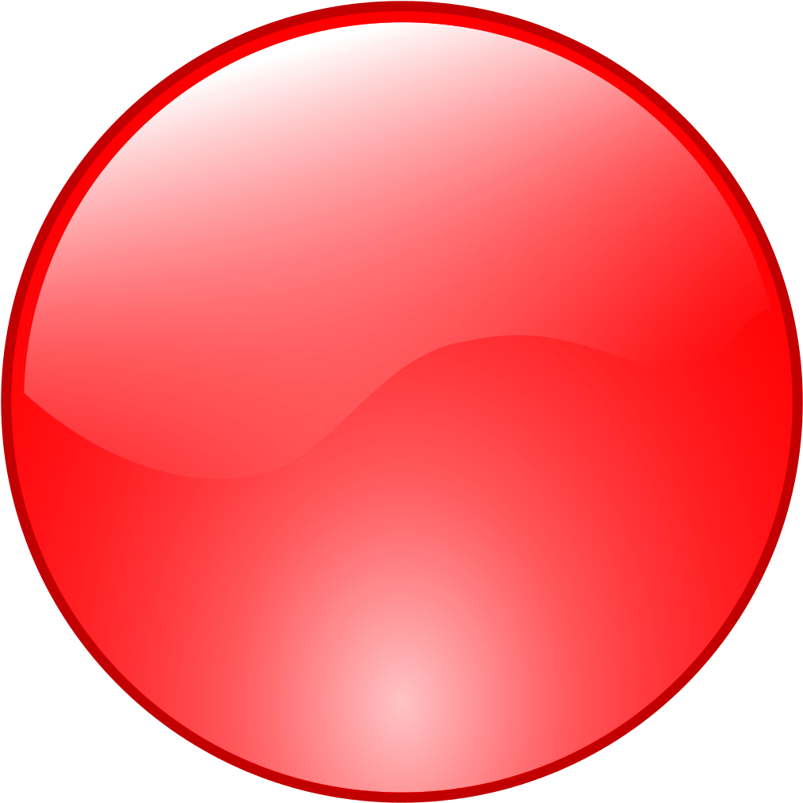

# Github readme connect-4

This is an open connect4 game ANYONE can play. This project is inspired by [this template](https://github.com/marcizhu/readme-chess). 
It uses github actions to trigger the script when a new issue opens, which in turn updates the board and closes the issue. 
You can try it out right now on [my profile](https://github.com/mastagoon).

It's your turn! You are playing as 

To play, click on any of the numbers at the bottom of the board.

| | | | | | | |
|:---:|:---:|:---:|:---:|:---:|:---:|:---:|
|  |  |  |  |  |  |  |
|  |  |  |  |  |  |  |
|  |  |  |  |  |  |  |
|  |  |  |  |  |  |  |
|  |  |  |  |  |  |  |
|  |  |  |  |  |  |  |
 | [1](https://github.com/Mastagoon/connect4-readme/issues/new?body=move+1&title=Connect4:+move:+1) | [2](https://github.com/Mastagoon/connect4-readme/issues/new?body=move+2&title=Connect4:+move:+2) | [3](https://github.com/Mastagoon/connect4-readme/issues/new?body=move+3&title=Connect4:+move:+3) | [4](https://github.com/Mastagoon/connect4-readme/issues/new?body=move+4&title=Connect4:+move:+4) | [5](https://github.com/Mastagoon/connect4-readme/issues/new?body=move+5&title=Connect4:+move:+5) | [6](https://github.com/Mastagoon/connect4-readme/issues/new?body=move+6&title=Connect4:+move:+6) | [7](https://github.com/Mastagoon/connect4-readme/issues/new?body=move+7&title=Connect4:+move:+7) |

 
 

Last 5 plays:
<!-- latest moves here -->

| Color | Player | Column | Message |
| --- | --- | --- | --- |
|  | [Mastagoon](https://github.com/Mastagoon) | 7 | null |
